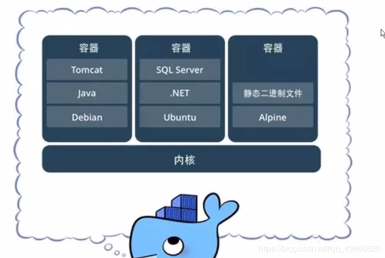
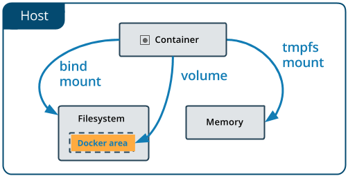
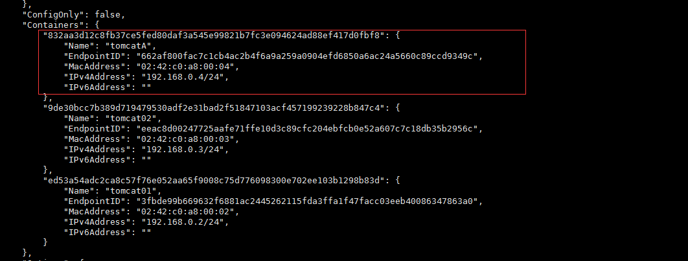
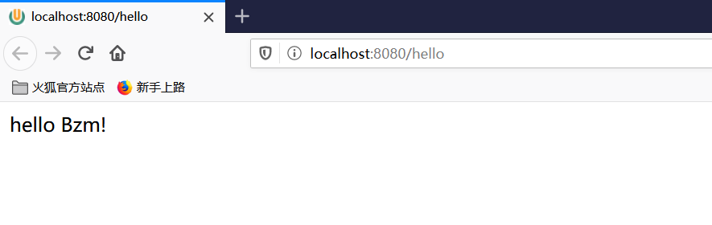
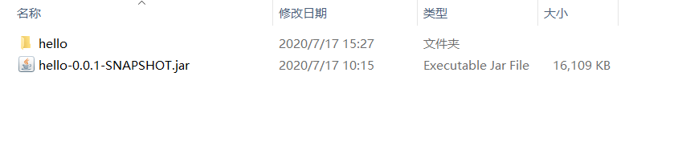
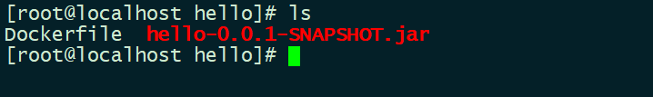
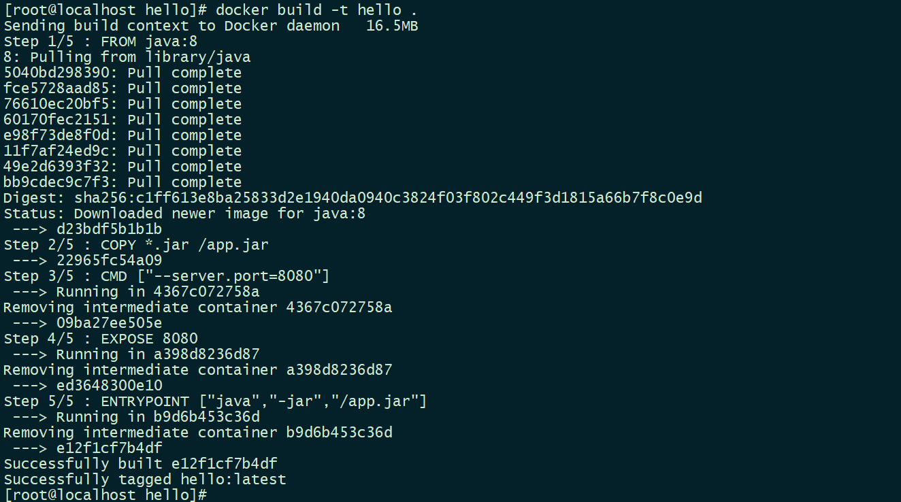
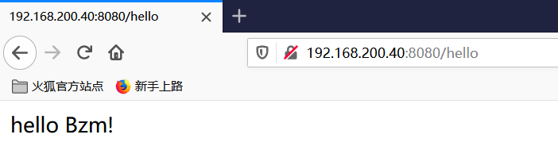

### Docker笔记

#### Docker简介

==容器就是将软件打包成标准化单元，以用于开发、交付和部署。==

- **标准：**Docker为集装箱创建了行业标准，这样它们就可以在任何地方便携。
- **轻量级：**容器共享机器的OS系统内核，因此不需要每个应用程序都有操作系统，从而提高了服务器效率，降低了服务器和许可成本
- **安全：**应用程序在容器中更安全，Docker提供了业界最强的默认隔离功能。



#### Docker安装

#### Docker基本命令

```shell 
# 显示docker的版本信息
docker version 

# 显示 Docker 系统信息，包括镜像和容器数
docker info

# 帮助命令
docker 命令 --help
```

> #### [Docker command line文档](https://docs.docker.com/engine/reference/commandline/cli/)

##### 镜像命令

###### docker images

`docker images`—— 列出本地镜像

```shell
docker images [OPTIONS] [REPOSITORY[:TAG]]
```

- **-a :**列出本地所有的镜像（含中间映像层，默认情况下，过滤掉中间映像层）
- **-q :**只显示镜像ID


```shell
[root@izqj7de25av7oxz ~]# docker images
REPOSITORY              TAG                 IMAGE ID            CREATED             SIZE
hello-world             latest              bf756fb1ae65        4 months ago        13.3kB

# REPOSITORY	镜像的仓库
# TAG			镜像的标签
# IMAGE ID  	镜像的id
# CREATED 		镜像的创建时间
# SIZE			镜像的大小
```

###### docker pull

`docker pull`——从镜像仓库中拉取或者更新指定镜像

```shell
docker pull [OPTIONS] 镜像名[:TAG|@DIGEST]

# 不加tag，默认就是最新的
```

``` shell
[root@izqj7de25av7oxz ~]# docker pull redis
Using default tag: latest
latest: Pulling from library/redis
afb6ec6fdc1c: Already exists		#分层下载，docker image的核心 联合文件系统
608641ee4c3f: Pull complete 
668ab9e1f4bc: Pull complete 
ea9ab8bf5f73: Pull complete 
137e0d1a14d9: Pull complete 
b2c5e1be4a59: Pull complete 
Digest: sha256:89051d5ec46a89d4a708467af38eaaf4029450c4b1b9835ffd413cf70625b22e
Status: Downloaded newer image for redis:latest
docker.io/library/redis:latest

```

###### docker rmi

`docker rm`——删除本地一个或多少镜像

```shell
docker rmi [OPTIONS] IMAGE [IMAGE...]
```

```shell
# 删除指定镜像，空格区分多个镜像（IMAGE ID）
[root@izqj7de25av7oxz ~]# docker rmi 987b78fc9e38
Untagged: redis:latest
Untagged: redis@sha256:89051d5ec46a89d4a708467af38eaaf4029450c4b1b9835ffd413cf70625b22e
Deleted: sha256:987b78fc9e38b2e1e42254002787e33b7e7d8b46995138f1d7783376d5accef4
Deleted: sha256:99906117197eaea48a89bac54c7ad3a0e5972b70e3667d623f2e6be6e726335c
Deleted: sha256:a42f270c18c742e82e229fd30d8c6f7dd9a5b7c19667b04cab60b6b675672308
Deleted: sha256:5431deb79f47a0702c13db421cef3d23a2a6e594c4381240cd1d5521db57d4ac
Deleted: sha256:f65b9f3331a36179d24fde0f222c292349b30a7c0455e832491833b06f20a4eb
Deleted: sha256:ecbe43fbdb4faf2f576ef25feaed19e949912e4ffc3b2a1f5dee9a3fd52128c4

# 删除全部镜像
docker rmi -f $(docker images -aq)	
```

##### 容器命令

###### docker run

`docker run`——创建一个新的容器并运行一个命令

```shell
docker run [OPTIONS] IMAGE [COMMAND] [ARG...]
```

- **--name="xxx-name":** 为容器指定一个名称
- **-d:** 后台运行容器，并返回容器ID
- **-p:** 指定端口映射，格式为：**主机(宿主)端口:容器端口**
- **-P（大写）:** 随机端口映射，容器内部端口**随机**映射到主机的高端口
- **-it**: 为容器分配一个伪输入终端，已交互方式运行容器

```shell
# 启动并交互方式进入容器
[root@izqj7de25av7oxz ~]# docker run -it centos /bin/bash
[root@0a28a022505b /]# ls
bin  dev  etc  home  lib  lib64  lost+found  media  mnt  opt  proc  root  run  sbin  srv  sys  tmp  usr  var
```

**退出容器**

```shell
[root@0a28a022505b /]# exit		#退出容器并停止
exit

# Ctrl+q+p		退出容器但不停止
[root@61979bf43fc9 /]# [root@izqj7de25av7oxz ~]# 
[root@izqj7de25av7oxz ~]# docker ps
CONTAINER ID        IMAGE                         COMMAND                  CREATED             STATUS              PORTS                    NAMES
61979bf43fc9        centos                        "/bin/bash"              27 seconds ago      Up 26 seconds                                adoring_gates
```


###### docker ps

`docker ps`——列出容器（默认运行中的）

```shell
docker ps [OPTIONS]
```

- **-a :**显示所有的容器，包括未运行的。
- **-q :**静默模式，只显示容器编号。
- **-n :**列出最近创建的n个容器。


```shell
[root@izqj7de25av7oxz ~]# docker ps
CONTAINER ID        IMAGE                         COMMAND                  CREATED             STATUS              PORTS                    NAMES
[root@izqj7de25av7oxz ~]# docker ps -a
CONTAINER ID        IMAGE                         COMMAND                  CREATED             STATUS                     PORTS                    NAMES
0a28a022505b        centos                        "/bin/bash"              6 minutes ago       Exited (0) 4 minutes ago                            lucid_satoshi
de352c8b7ba7        hello-world                   "/hello"                 13 hours ago        Exited (0) 13 hours ago                             gallant_robinson
```

###### docker rm

`docker rm`——删除一个或多个容器。

```shell
docker rm [OPTIONS] CONTAINER [CONTAINER...]
```

- **-f :**通过 SIGKILL 信号强制删除一个运行中的容器。
- **-l :**移除容器间的网络连接，而非容器本身。
- **-v :**删除与容器关联的卷。

```shell
# 删除停止运行的容器
docker ps -a | grep "Exited" | awk '{print $1 }'|xargs docker rm
docker rm $(sudo docker ps -qf status=exited)
```

###### docker start

`docker start`——启动一个或多个已经被停止的容器

```shell
docker start [OPTIONS] CONTAINER [CONTAINER...]
```

###### docker stop

`docker stop`——停止一个运行中的容器

```shell
docker stop [OPTIONS] CONTAINER [CONTAINER...]
```

###### docker restart

`docker restart` ——重启容器

```
docker restart [OPTIONS] CONTAINER [CONTAINER...]
```

###### docker logs

`docker logs`——获取容器的日志

```shell
docker logs [OPTIONS] CONTAINER
```

- **-f :** 跟踪日志输出
- **-t :** 显示时间戳
- **--tail num :**仅列出最新N条容器日志

```shell
docker logs -t -f --tail 10 容器id
```

docker top

`docker top`——查看容器中运行的进程信息

```shell
docker top CONTAINER [ps OPTIONS]
```

```shell
docker top 容器id
[root@izqj7de25av7oxz ~]# docker top 23a9d8410416
UID                 PID                 PPID                C                   STIME               TTY                 TIME                CMD
root                1801                1771                0                   09:15               ?                   00:00:00            /bin/bash -c while true;do echo Bzm;sleep 1;done
root                3170                1801                0                   09:31               ?                   00:00:00            /usr/bin/coreutils --coreutils-prog-shebang=sleep /usr/bin/sleep 1

```

###### docker inspect

`docker inspect`——获取容器/镜像的元数据。

```shell
docker inspect [OPTIONS] NAME|ID [NAME|ID...]
```

###### docker exec

`docker exec`——在运行的容器中执行命令

```shell
docker exec [OPTIONS] CONTAINER COMMAND [ARG...]
```

- **-d :**分离模式: 在后台运行
- **-i :**即使没有附加也保持STDIN 打开
- **-t :**分配一个伪终端

```shell
docker exec -it naughty_bohr /bin/bash
```

###### docker attach

`docker attach`——连接到正在运行中的容器。

```shell
docker attach [OPTIONS] CONTAINER
```

###### docker cp

`docker cp`——用于容器与主机之间的数据拷贝。

```shell
docker cp [OPTIONS] CONTAINER:SRC_PATH DEST_PATH|-
docker cp [OPTIONS] SRC_PATH|- CONTAINER:DEST_PATH
```

```shell
# 容器内拷贝到主机
docker cp 23a9d8410416:/tmp/aa /home/

# 主机拷贝到容器
docker cp Bzm 23a9d8410416:/tmp/aa 

# 注意：若文件存在，则替换其中内容
```

---


#### Docker [数据卷](https://www.jianshu.com/p/19f12c616d0c)

##### 联合文件系统

`Docker镜像`是有多层`只读文件`叠加而成，当运行起一个容器的时候，Docker会在制只读层上创建一个`读写层`。如果运行中的容器需要修改文件，那么并不会修改只读层的文件，只会把该文件复制到`读写层`然后进行修改，只读层的文件就被隐藏了。当删除了该容器之后，或者重启容器之后，之前对文件的更改会丢失，镜像的只读层以及容器运行是的“读写层”被称为`联合文件系统（Union File System）`


##### 数据卷特点

1. 数据卷存在于宿主机的文件系统中，独立于容器，和容器的生命周期是分离的。
2. 数据卷可以是目录也可以是文件，容器可以利用数据卷与宿主机进行数据共享，实现了荣期间的数据共享和交换。
3. 容器启动初始化时，如果容器使用的镜像包含了数据，这些数据会拷贝到数据卷中。
4. 容器对数据卷的修改是实时进行的。
5. 数据卷的变化不会影响镜像的更新。数据卷是独立于联合文件系统，镜像是基于联合文件系统。镜像与数据卷之间不会相互影响。

 




##### 创建和管理卷

```shell
# 创建卷
$ docker volume create my-vol


# 列表卷
$ docker volume ls

local               my-vol

# 显示详细信息

$ docker volume inspect my-vol
[
    {
        "CreatedAt": "2020-05-30T12:39:54+08:00",
        "Driver": "local",
        "Labels": {},
        "Mountpoint": "/var/lib/docker/volumes/my-vol/_data",
        "Name": "my-vol",
        "Options": {},
        "Scope": "local"
    }
]

# 移除卷
$ docker volume rm my-vol
my-vol
```


#####  数据卷使用

```shell
# --mount
$ docker run -d \
  --name nginx01 \
  --mount source=myvol2,target=/app \
  nginx:latest

# -v 
$ docker run -d \
  --name nginx01 \
  -v myvol2:/app \
  nginx:latest
```


##### Mysql同步数据

```shell
sudo docker run -d -p 3306:3306 --restart always --name mysql01 -e MYSQL_ROOT_PASSWORD=123456 -d -v /media/docker-V/mysql/data:/var/lib/mysql  mysql:5.7 --character-set-server=utf8mb4 --collation-server=utf8mb4_unicode_ci
```


##### 匿名挂载，具名挂载


##### 数据卷容器

```shell
# 父容器centos01
docker run -it -v /media/docker-V/centos/mnt:/mnt --name centos01 centos

# 子容器centos02
docker run -it --volumes-from centos01 --name centos02 centos

# 子容器centos03
docker run -it --volumes-from centos01 --name centos03 centos

```

> 数据卷容器之间数据相互共享，生命周期直到所有容器消失

---


#### Docker 镜像原理

[Docker 镜像原理](https://www.cnblogs.com/asxf/p/11102949.html)

#### Docker镜像制作

###### docker diff

`docker diff` ——检查容器里文件结构的更改。

```shell
docker diff [OPTIONS] CONTAINER
```

```shell
[root@izqj7de25av7oxz ~]# docker diff 2a72437bb195
C /run
C /run/nginx.pid
```


###### docker commit

`docker commit`——从容器创建一个新的镜像。

```shell
docker commit [OPTIONS] CONTAINER [REPOSITORY[:TAG]]
```

- **-a :**提交的镜像作者；
- **-c :**使用Dockerfile指令来创建镜像；
- **-m :**提交时的说明文字；
- **-p :**在commit时，将容器暂停。

[commit 理解镜像构成](https://www.cnblogs.com/panpanwelcome/p/12603864.html)

```shell
docker commit -a 'bzm' -m 'hello' nginx01 nginx-bzm:1.0
```


#### Dockerfile

`Dockerfile `是一个用来构建镜像的文本文件，文本内容包含了一条条构建镜像所需的指令和说明。

##### Dockerfile构建过程


##### Dockefiler命令

###### FROM

指定基础镜像，必须为`dockerfile`中的第一个命令


###### MAINTAINER

 维护者信息


###### RUN

构建镜像时执行的命令，一个文件中可以包含多个`RUN`命令


###### ADD

将本地文件添加到容器中，tar类型文件会自动解压(网络压缩资源不会被解压)，可以访问网络资源，类似wget


###### COPY

功能类似ADD，但是是不会自动解压文件，也不能访问网络资源


###### ENV

设置环境变量


###### VOLUME

添加卷，用于指定持久化目录


###### EXPOSE

指定暴露镜像的端口供主机做映射


###### WORKDIR

指定工作目录，类似于cd命令，之后的命令都是基于此工作目录


###### CMD

构建容器后调用，也就是在容器启动时才进行调用，存在多个CMD时只有最后一个生效，也支持exec语法。


###### ENTRYPOINT

配置容器，使其可执行化。配合CMD可省去"application"，只使用参数。

> CMD的命令会被 docker run 的命令覆盖而ENTRYPOINT不会

###### ONBUILD

用于设置镜像触发器


##### 注意


##### 编写Dockerfile

```dockerfile
FROM centos
MAINTAINER Bzm<2794127547@qq.com>
ENV MPATH /usr/local
WORDIR $MPATH

RUN yum install -y vim
RUN yum install -y net-tools

EXPOSE 80

CMD echo $MPATH
CMD /bin/bash

```


```shell
# 构建镜像
docker build -f dockerfile-centos -t mycentos:0.1 .

Successfully built dcd4b13e044e
Successfully tagged mycentos:0.1

```


###### docker build

`docker build`——命令用于使用 Dockerfile 创建镜像。

```shell
docker build [OPTIONS] PATH | URL | -
```

- **-f :**指定要使用的Dockerfile路径；
- **--tag, -t:** 镜像的名字及标签，通常 name:tag 或者 name 格式；可以在一次构建中为一个镜像设置多个标签。
- **--quiet, -q :**安静模式，成功后只输出镜像 ID；

```shell
docker build -f dockerfile-centos -t mycentos:0.1 .
```

>  **docker build . 最后的 . 号，其实是在指定镜像构建过程中的上下文环境的目录。**


###### docker history

`docker history`——查看指定镜像的创建历史。

```shell
docker history [OPTIONS] IMAGE
```

```shell
[root@izqj7de25av7oxz dockerfile]# docker history 470671670cac
IMAGE               CREATED             CREATED BY                                      SIZE                COMMENT
470671670cac        4 months ago        /bin/sh -c #(nop)  CMD ["/bin/bash"]            0B                  
<missing>           4 months ago        /bin/sh -c #(nop)  LABEL org.label-schema.sc…   0B                  
<missing>           4 months ago        /bin/sh -c #(nop) ADD file:aa54047c80ba30064…   237MB             
```


---

#### 镜像发布

##### DockerHub


#### docker网络

| Docker网络模式 | 配置                      | 说明                                                         |
| -------------- | ------------------------- | ------------------------------------------------------------ |
| host模式       | –net=host                 | 容器和宿主机共享Network namespace。                          |
| container模式  | –net=container:NAME_or_ID | 容器和另外一个容器共享Network namespace。 kubernetes中的pod就是多个容器共享一个Network namespace。 |
| none模式       | –net=none                 | 容器有独立的Network namespace，但并没有对其进行任何网络设置，如分配veth pair 和网桥连接，配置IP等。 |
| bridge模式     | –net=bridge               | （默认为该模式）                                             |

###### docker network

`docker network`——管理网络

```
[root@izqj7de25av7oxz ~]# docker network ls
NETWORK ID          NAME                       DRIVER              SCOPE
d9ffbb45322a        bridge                     bridge              local
04f9feff0045        codimd-container_backend   bridge              local
723b67f2e523        host                       host                local
b69b99cb7b27        none                       null                local

```


```shell
# 运行一个tomcat容器
[root@izqj7de25av7oxz ~]# docker run -d -P --name tomcat01 tomcat

# 查看容器ip，为172.18.0.2
[root@izqj7de25av7oxz ~]# docker exec -it tomcat01 ip addr
1: lo: <LOOPBACK,UP,LOWER_UP> mtu 65536 qdisc noqueue state UNKNOWN group default qlen 1
    link/loopback 00:00:00:00:00:00 brd 00:00:00:00:00:00
    inet 127.0.0.1/8 scope host lo
       valid_lft forever preferred_lft forever
131: eth0@if132: <BROADCAST,MULTICAST,UP,LOWER_UP> mtu 1500 qdisc noqueue state UP group default 
    link/ether 02:42:ac:12:00:02 brd ff:ff:ff:ff:ff:ff link-netnsid 0
    inet 172.18.0.2/16 brd 172.18.255.255 scope global eth0
       valid_lft forever preferred_lft forever

# 本机能ping通容器
[root@izqj7de25av7oxz ~]# ping 172.18.0.2
PING 172.18.0.2 (172.18.0.2) 56(84) bytes of data.
64 bytes from 172.18.0.2: icmp_seq=1 ttl=64 time=0.054 ms
64 bytes from 172.18.0.2: icmp_seq=2 ttl=64 time=0.061 ms
64 bytes from 172.18.0.2: icmp_seq=3 ttl=64 time=0.054 ms
^C
--- 172.18.0.2 ping statistics ---
3 packets transmitted, 3 received, 0% packet loss, time 1999ms
rtt min/avg/max/mdev = 0.054/0.056/0.061/0.007 ms

```

> 我们每启动一个`docker`容器`docker`就会给`docker`容器分配-个`ip `,我们只要安装了`docker `,就会有一个网 卡`docker0`——桥接模式：`veth-pair`技术
>
> 
>
> `veth-pair`就足一对的虚拟设备接口，他们都是成对出现的，一端连着协议，一端彼此相连

##### 桥接模式


> 只要删除容器，对应的网桥也会删除


##### 自定义网络

```shell
# 自定义网络
docker network create docker01 --subnet=192.168.0.0/24 --gateway 192.168.0.1 -o com.docker.network.bridge.name=docker01
#-o选项可以解决使用ifconfig命令看不到自己创建的网桥名字的问题

 docker run -d -P --name tomcat01 --net docker01 tomcat 
 docker run -d -P --name tomcat02 --net docker01 tomcat 

# 自定义的网络，可以通过ping容器
[root@izqj7de25av7oxz ~]# docker  exec -it tomcat01 ping tomcat02
PING tomcat02 (192.168.0.3) 56(84) bytes of data.
64 bytes from tomcat02.docker01 (192.168.0.3): icmp_seq=1 ttl=64 time=0.065 ms
64 bytes from tomcat02.docker01 (192.168.0.3): icmp_seq=2 ttl=64 time=0.060 ms
64 bytes from tomcat02.docker01 (192.168.0.3): icmp_seq=3 ttl=64 time=0.067 ms
^C
--- tomcat02 ping statistics ---
3 packets transmitted, 3 received, 0% packet loss, time 1000ms
rtt min/avg/max/mdev = 0.060/0.064/0.067/0.003 ms

```

> 连接到同一个用户定义的网桥的容器会自动将**所有端口**相互暴露，而**不会**向外界显示**任何端口**。这使得容器化应用程序可以轻松地相互通信，而不会意外地打开对外界的访问。


##### 网络连通

```shell
# 创建两个容器A，B
docker run -d -P --name tomcatA tomcat 
docker run -d -P --name tomcatB tomcat 

# docker01网络连接容器A
docker network connect docker01 tomcatA

# A容器能ping通docker01网络容器
[root@izqj7de25av7oxz ~]# docker exec -it tomcatA ping tomcat01
PING tomcat01 (192.168.0.2) 56(84) bytes of data.
64 bytes from tomcat01.docker01 (192.168.0.2): icmp_seq=1 ttl=64 time=0.050 ms
64 bytes from tomcat01.docker01 (192.168.0.2): icmp_seq=2 ttl=64 time=0.070 ms
64 bytes from tomcat01.docker01 (192.168.0.2): icmp_seq=3 ttl=64 time=0.062 ms
^C
--- tomcat01 ping statistics ---
3 packets transmitted, 3 received, 0% packet loss, time 2ms
rtt min/avg/max/mdev = 0.050/0.060/0.070/0.012 ms

# B容器能ping通docker01网络容器
[root@izqj7de25av7oxz ~]# docker exec -it tomcatB ping tomcat01
ping: tomcat01: Name or service not known

```

> **原理**
>
> 创建一个容器A的ip，放在`docker01`网络中（一个容器两个ip）

```
docker network inspect docker01
```




#### 实战

##### SpringBoot微服务打包Docker镜像

1、编写一个简单的`hello`程序

```java
@Controller
public class HelloController {

    @ResponseBody
    @RequestMapping("/hello")
    public String hello() {
        return "hello Bzm!";
    }
}
```



 2、使用`maven`进行`package`打包

[hello-0.0.1-SNAPSHOT.jar](../资料/hello-0.0.1-SNAPSHOT.jar)



3、编写Dockerfile文件，并和它和jar包上传到Linux服务器

```dockerfile
FROM java:8
COPY *.jar /app.jar
CMD ["--server.port=8080"]
EXPOSE 8080
ENTRYPOINT ["java","-jar","/app.jar"]
```



4、build构建镜像hello

```shell
$ docker build -t hello .
```



5、运行测试

```shell
$ docker run -d -p 8080:8080 --name hello hello
```




##### Redis集群


---


#### Docker Compose

#### Docker Swarm

#### CI/CD之Jenkins

